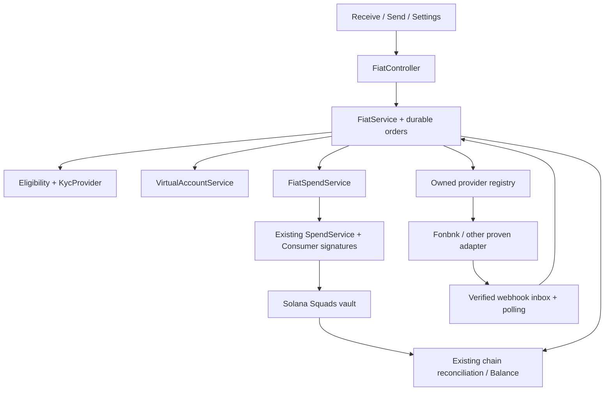

# Consumer fiat code architecture and route probes

Latest founder revision: temporary virtual accounts are parked; investigate distinct NGN holding, reusable accounts and Paga/Sui/Crossmint, plus Bridge USD rails. See [revised naira-account proposal](consumer-naira-account-revision.md), which supersedes older launch prioritisation below. Historical provider recommendations are retained as research history, not the latest selection. No existing production balance model or cross-chain implementation changes are implied.

Date: 2026-09-08. Status: architecture with first implementation slice completed. Provider selection remains conditional on authenticated discovery and execution. Companion: [research and scope](consumer-fiat-rails-launch-research.md).

Implementation checkpoint: provider-neutral mobile Receive/Send, normalized quote contracts, Fonbnk sandbox quote adapter, simulator, PostgreSQL orders/events, ownership and idempotency checks are implemented. Real-money signing, provider webhooks/KYC, account issuance and fiat-to-fiat remain gated work, not completed features. See `apps/backend/src/fiat/README.md` for the exact implemented boundary and provider replacement procedure. The file map below retains the broader planned architecture; it is not an inventory of implemented files.

## Scope and fixed boundaries

Receive: temporary and permanent NGN accounts, converting into native Solana USDC. Send: USDC to NGN bank recipients. Fiat-to-fiat is recorded but separately gated until its funding/custody model is established. No implicit NGN → USDC → NGN round trip. Consumer release is the immediate priority; merchant launch is separate.

Preserve ADR 0010 provider isolation, ADR 0026 Account-funded spending, ADR 0032 spending limits, and CONTEXT.md's chain-confirmed Balance. Consumer assets land in the Squads vault, never the Privy signer address. No Xend-operated cross-chain bridge. Full KYC does not bypass signing policy.

## Code map

```text
apps/backend/src/
  fiat/                              NEW Nest module
    fiat.controller.ts               Consumer routes, auth, ownership, DTO validation
    fiat.service.ts                  Quote/order orchestration
    fiat-provider.interface.ts       Owned ramp capabilities and operations
    fiat-provider.registry.ts        Resolve enabled provider per exact route
    fiat-eligibility.service.ts      Direction/account-type requirements
    fiat-spend.service.ts            Bind approved order to existing SpendService
    fiat-reconciler.service.ts       Durable work + scheduled provider reconciliation
    fiat-webhook.controller.ts       Verify, persist inbox, acknowledge
    fiat.repository.ts              Atomic state transitions and operation claims
    fiat-activity.service.ts         Link bank progress to existing chain Activity
    dtos.ts                          Zod contracts and typed errors
    providers/fonbnk/                First adapter AFTER route proof
  virtual-account/                   EXTEND existing interface; add module/service/store
  kyc/                               COMPLETE existing provider and Sumsub adapter
  account/spend.service.ts           REUSE prepare/submit, authority fee payer
  prepared/                          REUSE short-lived message pins only
  db/schema.ts                       ADD durable fiat tables; generated migration

apps/mobile/
  components/ui/organisms/modals/
    ReceiveModal.tsx                 Existing Fiat choice opens larger sheet
    FiatReceiveSheet.tsx             NEW requirements/account/instructions/progress
  app/(send)/fiatamount.tsx           REPLACE legacy ACH placeholder with NGN flow
  app/(tabs)/settings/bank-accounts.tsx NEW account/verification/conversion settings
  hooks/useFiatRoutes.ts             NEW capability discovery
  hooks/useFiatQuote.ts              NEW expiring quote
  hooks/useFiatOrder.ts              NEW create/resume/status
  hooks/useVirtualAccounts.ts        NEW permanent/temp account lifecycle
  hooks/useVerification.ts           NEW server-owned status/hosted verification
  utils/apiClient.ts                 REUSE authenticated transport
```

These are planned files, not claims that the modules exist. Keep provider secrets and SDK calls backend-only. Preserve existing mobile signing/presence ceremonies: fiat spends must meet the same proofs as TransferService, not merely call SpendService with arbitrary client parameters.



## Owned contracts

`FiatProvider` exposes `discoverRoutes`, `getLimits`, `quote`, `createOrder`, `getOrder`, and verified webhook normalization. Confirmation/cancellation/return methods are capability-dependent and must reflect actual provider semantics. An API failure is never converted to a fake success. Registry selection occurs before order creation; an existing order stays pinned to its provider/environment.

Route identity includes provider, environment, country, source and destination currency, network, mint, payment channel, direction, and third-party restrictions. Advertise temporary accounts, permanent accounts, NGN holding, direct fiat-to-fiat, external-vault delivery, automatic receipt confirmation, and return support independently. Disabled or unknown capability is not eligible.

`ExecutableFiatQuote` includes opaque provider quote ID, expiry, exact source debit and destination credit, currency/decimals, all fees, minimum/maximum/step, transfer-step type, required input schema, and destination/beneficiary binding. Persist its normalized snapshot. Internal monetary values are integer strings (NGN kobo, USDC six decimals), calculated with exact arithmetic. Adapters handle decimal conversion and provider step constraints explicitly; reject values that cannot round-trip safely. Never use floating-point arithmetic to size a Spend.

Do not stretch checkout's existing `FxQuoteProvider.getQuote()` into this contract: it lacks order identity, expiry, direction, beneficiary, and executable amounts. A future checkout adapter can reuse provider infrastructure while preserving ADR 0023 merchant pricing semantics. Consumer order tracking does not belong in merchant `SettlementProvider` or `settlementOfframps`.

Extend `VirtualAccountProvider` with account kind, provider reference, beneficiary name, lifecycle, provider expiry for temporary accounts, settlement destination, permitted senders and conversion capability. A temporary order with shared agent bank instructions is represented as such, never relabelled a dedicated temporary account.

KYC service stores Xend verification and provider-specific eligibility separately. Complete `SumsubAdapter`; extend the existing access contract explicitly if hosted links are chosen (current interface only issues a token). Collect basic fields only when required, encrypt necessary sensitive records, avoid BVN/ID values in logs, and retain provider references instead of unnecessary document copies. Provider field schemas pass through an allowlisted normalized UI schema, never arbitrary HTML or executable content.

## Persistence and consistency

Planned tables in the existing Drizzle schema:

| Table | Responsibility / key constraints |
| --- | --- |
| `fiat_quotes` | Owner, route, normalized amounts/fees/expiry, provider reference; immutable snapshot |
| `fiat_orders` | Owner, kind, quote/account/beneficiary snapshot, provider/environment, version, status, linked chain Activity; unique owner + client idempotency key |
| `fiat_operations` | Durable create/confirm/return/broadcast attempt, request hash, external reference, status, retry time and lease; unique order + operation identity |
| `fiat_provider_events` | Verified durable inbox; unique provider + environment + event ID; processing status and retry metadata |
| `virtual_accounts` | Owner, provider account reference, kind, expiry/lifecycle and destination; unique provider + environment + account reference |
| `fiat_receipts` | One incoming receipt per provider transfer ID; links permanent account to individual conversion order; unique provider + environment + receipt ID |
| `fiat_preferences` | Conversion policy/version and explicit consent time; applies to future uncommitted receipts |
| `verification_profiles` | Consumer/provider applicant, level, status, expiry; authoritative webhook/poll revision |

Use PostgreSQL row version checks/locks and durable operation claims with the existing scheduled-worker approach. No new message broker is required. Remote calls run outside database locks. Persist intent before the call; persist the response after it. On an ambiguous timeout, reconcile by external reference/idempotency key before retry. If a provider cannot deduplicate or look up an uncertain write, stop for reconciliation rather than issue another payment.

The existing `InboundWebhookDedupe.claim/release` alone is insufficient for recoverable fiat processing after process death. Verify raw-body signatures first, insert the event durably, then acknowledge. Worker processing and resulting DB transitions commit atomically; side effects use `fiat_operations`. Validate signed timestamps according to actual provider retry semantics, not a generic rule that rejects legitimate old events.

Use existing chain transfer identity (including instruction/transfer identity where needed) to deduplicate credits. Never increment Balance from a provider webhook. Link the same chain transfer to the fiat order rather than show duplicate Receives/Spends.

## Execution flows

### Receive NGN

1. Discover route and requirements; quote against exact amount and Account destination.
2. Satisfy required verification; create provider order idempotently before presenting instructions.
3. Show actual transfer type, amount, fees, bank details, expiry, and sender policy. Dedicated temporary accounts require explicit provider proof.
4. Track `awaiting_fiat → fiat_received → converting → awaiting_chain → completed`. Completion requires correct network/mint/destination/amount on chain, not a provider success label alone.
5. Reconcile late, partial, excess, duplicate and unidentified deposits. Expiry stops new intended funding; late funds require a return/recovery record, not deletion.

Permanent accounts create a separate receipt/conversion order per incoming transfer. Auto-conversion off is enabled only with proven provider-held NGN and manual conversion support. Preference changes are versioned; already committed conversions finish under their original consent. Unknown-price automatic conversions require a disclosed fee/rate policy and limits; do not imply a short-lived quote covers indefinite future receipts.

### Send USDC to NGN

1. Resolve bank beneficiary; quote exact debit/credit, validate eligibility and user approval.
2. Persist provider order and its deposit address; bind its full snapshot to the Xend order.
3. Prepare via existing SpendService with server-pinned native mint, amount and provider destination. Record message hash, blockhash deadline and order binding. Revalidate quote/provider funding deadline before submission; ensure sufficient funding window or obtain fresh consent.
4. Consumer signs through the existing ceremony. Verify owner, presence requirements and exact message, then authority co-signs and broadcasts. Persist/derive transaction identity before an uncertain broadcast; resume observation of that transaction rather than signing a second debit. Only prepare a replacement after proving the previous attempt cannot land.
5. Observe `awaiting_signature → chain_submitted → provider_funded → bank_sending → completed`. Require authoritative bank payout success/reference. USDC debit confirmation alone is not completion.
6. On payout failure after debit, use `return_pending`/`needs_attention`, then `returned` only with confirmed return evidence. Never claim the original Balance was restored just because the bank leg failed.

Model collection/chain/payout/return facts separately from the UI status, so out-of-order notifications cannot regress completion or lose a late receipt. Handle `expired`, `cancelled`, and `failed_before_funding` separately from post-funding recovery. Bank completion and returns remain distinct from CONTEXT.md's existing on-chain Spend Status.

## API surface and mobile ownership

Proposed authenticated routes (all resources scoped to the current Consumer):

- `GET /fiat/routes`, `POST /fiat/quotes`, `POST /fiat/orders`, `GET /fiat/orders/:id`.
- `POST /fiat/orders/:id/prepare-spend`, `POST /fiat/orders/:id/submit-spend` with existing signing proofs; destination and amount come from the stored order.
- `GET/POST /virtual-accounts`, `PATCH /fiat/preferences` with preference version.
- `POST /kyc/start`, `GET /kyc/status`; provider-specific verified webhook endpoints.

Create/submit mutations require idempotency keys and reject reuse with a different request hash. Return typed `ROUTE_UNAVAILABLE`, `VERIFICATION_REQUIRED`, `QUOTE_EXPIRED`, `ORDER_CONFLICT`, `PROVIDER_UNAVAILABLE` and `RECONCILIATION_REQUIRED` states. Mobile renders recovery choices and resumes orders after app restart. It never decides KYC approval or chooses a replacement payment destination.

## Implementation and test sequence

1. Authenticated provider probe, then freeze the first adapter contract. No application implementation before the route findings are reviewed.
2. Durable quote/order/reconciliation core plus one adapter; start with one-time ramp orders if dedicated accounts are not available, subject to explicit product acceptance of that different experience.
3. Send integration through existing signing path; Receive chain linkage; mobile sheets.
4. Permanent accounts, verification upgrade and preference semantics only after provider proof. Direct fiat-to-fiat remains independently gated.

Meaningful automated tests: duplicate create/submit, changed idempotency payload, webhook/poll race, crash after provider acceptance, lost broadcast response, expired quote, beneficiary/destination substitution, wrong mint/network, under/overpayment, late receipt, bank failure after debit, return confirmation, preference race. Contract tests use sanitized captured sandbox responses; sandbox success does not prove production bank settlement.

## Today's probes: actual observations

### Authenticated sandbox follow-up, 15:54 UTC and subsequent order probes

The founder supplied the complete server-to-server test credential pair after the initial unauthenticated probes below. It authenticated successfully against sandbox. Credentials are in ignored backend `.env`, not this document. This supersedes the earlier missing-credentials blocker.

| Test | Observed result |
| --- | --- |
| Signed sandbox discovery | NGN bank deposits/payouts enabled; `SOLANA_USDC` deposits/payouts enabled. Sandbox mint `4zMMC9srt5Ri5X14GAgXhaHii3GnPAEERYPJgZJDncDU`, not mainnet USDC. |
| NGN → Solana USDC limits | NGN 1,432–715,513, whole-naira step; crypto USD-equivalent 1–500. Snapshot only. |
| NGN 10,000 quote | Deposit fee reported NGN 250; payout 6.987995 sandbox USDC. Quote ID `6aa02fbbac337e846499f942`; expiry 2026-09-08T16:24:35.556Z. Manual deposit transfer type. |
| Solana USDC → NGN limits | 1–500 test USDC, step 0.000001; NGN 1,337–667,997. Snapshot only. |
| 10 test USDC quote | NGN 13,359 after fees; pre-fee 13,702; fee field 342.55. Quote ID `6aa02fbcac337e846499f943`; expiry 2026-09-08T16:24:36.169Z. Preserve quoted amounts; do not independently derive recipient amount from rounded fee display. |
| Sandbox KYC pre-check, synthetic identity | HTTP 403: account feature not available; contact support. No end-user KYC result obtained. |
| Sandbox create order, NGN → USDC | HTTP 403 with the same account-feature response. No order created. |
| Sandbox create order, USDC → NGN | HTTP 403 with the same account-feature response. No order created. |

Quotes expose forced deposit success/invalid outcomes in both directions; the NGN deposit also exposes underpayment/overpayment. Both payout legs expose success/failure controls. Those options were discovered, NOT executed. Synthetic example.com identity, documentation IP and test bank/address fields were used only for sandbox permission probes. No confirmation, bank payment, chain transaction, full KYC submission or real-money movement occurred.

Conclusion: authentication, exact sandbox discovery, limits and quotes pass; order execution is blocked by the documented create-users permission. No production route, temporary bank account, automatic conversion, webhook delivery or vault integration is proven by these results.

Unsent support request: “Please enable the create-users permission for our Xend sandbox integration. Signed discovery and NGN/SOLANA_USDC quotes work, but GET /api/v2/user/kyc and POST /api/v2/order return 403 feature unavailable in both directions. We need sandbox end-user/order access to exercise the documented deposit and payout simulations. Please also confirm whether live server-to-server approval is separate.” No provider message was sent by the assistant.

### Initial unauthenticated observations

No provider credentials were configured in the current backend/mobile environment or matching process variables. Founder confirmed no accounts yet and is creating access. No personal identity data, account creation, quote creation, trade, transfer or funded order was submitted.

| Probe on 2026-09-08 | Result | What it proves |
| --- | --- | --- |
| Fonbnk sandbox `GET /api/v2/currencies` | HTTP 400, signature/client-ID/timestamp validation | Endpoint responds; authentication required |
| Fonbnk production `GET /api/v2/currencies` | Same HTTP 400 | Production endpoint responds; no route availability established |
| Fonbnk production `GET /api/v2/order-limits`, NGN bank → SOLANA_USDC crypto | Same HTTP 400 | Exact route request attempted, blocked at authentication |
| Fonbnk production `GET /api/v2/order-limits`, SOLANA_USDC crypto → NGN bank | Same HTTP 400 | Reverse route request attempted, blocked at authentication |
| Breet `GET https://api.breet.io/v1/trades/assets`, no credentials | HTTP 400, missing headers | Endpoint responds; asset/corridor availability not established |
| Bread documented `GET https://api.bread.africa/tokens` | TLS hostname mismatch, curl exit 60; no HTTP response | Cannot safely use this documented host from this environment yet; confirm canonical host. Certificate verification was not bypassed. |

These are access probes, not passing payment tests. No live quote or conversion succeeded. Bread's result is an observed connection issue, not a claim its whole service is down.

### Next authenticated probe

Fonbnk's current v2 discovery is `/api/v2/currencies`; limits are `/api/v2/order-limits`; quotes use `POST /api/v2/quote`. Check live channel flags, exact asset/mint, nonzero pair limits, then quote each direction. All-zero limits can be returned with HTTP 200 and mean unavailable. Quote success does not establish order-creation permission. [Currencies](https://docs.fonbnk.com/server-to-server/api-endpoints/get-available-currencies), [Limits](https://docs.fonbnk.com/server-to-server/api-endpoints/get-order-limits), [Quote](https://docs.fonbnk.com/server-to-server/api-endpoints/create-quote)

Example quote body for a NGN 10,000 discovery test, adjusted to live limits (not an instruction to move this amount):

```json
{
  "deposit": { "paymentChannel": "bank", "currencyType": "fiat", "currencyCode": "NGN", "countryIsoCode": "NG", "amount": 10000 },
  "payout": { "paymentChannel": "crypto", "currencyType": "crypto", "currencyCode": "SOLANA_USDC" }
}
```

Reverse quote: deposit `crypto/SOLANA_USDC` with a proposed 10 USDC amount, payout `bank/fiat/NGN/NG`, adjusted to actual limits. Set exactly one amount. Capture quote ID/expiry, debit, credit, fees, required fields, transfer type and production mint; distinguish quoted capability from dedicated account issuance.

Then sandbox orders: simulate success, underpayment/overpayment and payout failure using only the options returned by that quote. Sandbox offers and bank/mint values are fixtures, not production evidence. [Environments](https://docs.fonbnk.com/server-to-server/servers)

For funded production proof, first prepare a concrete test showing approved source Account/bank, destination, amount, fees and expected receipt. Once the founder confirms those details, execute and capture both chain and bank evidence. Never send mainnet money to a sandbox address. Do not send BVN or secrets in chat.

### Access links

Sandbox-only diagnostic harness now exists at `apps/backend/scripts/probe-fonbnk.mjs`; run with Node 24 from the repository root. It reads backend `.env` (process variables take precedence), refuses non-sandbox operation, signs exact paths/queries, and requests discovery, limits and quotes only. It never creates users/orders, confirms deposits or transfers money. Syntax, missing-configuration guards and authenticated discovery/quote behavior were checked. Separate sandbox permission probes produced the 403 results above. The originally supplied widget credential was not used; the subsequent server-to-server pair authenticated successfully.

```sh
node apps/backend/scripts/probe-fonbnk.mjs
```

Current Fonbnk docs explicitly gate order creation and user KYC endpoints on the account's create-users permission. Quotes may succeed without it. Order confirmation is not an idempotent no-op: read status after a timeout before retrying. These constraints must be verified in sandbox before committing to this integration. [Create order](https://docs.fonbnk.com/server-to-server/api-endpoints/create-order), [Confirm order](https://docs.fonbnk.com/server-to-server/api-endpoints/confirm-order)

- Fonbnk [sandbox](https://sandbox-dashboard.fonbnk.com/login) and [production](https://dashboard.fonbnk.com/): API Settings → Client ID and API signature secret. [Setup](https://docs.fonbnk.com/server-to-server/getting-started)
- Bread [developer dashboard](https://developer.bread.africa/): API Keys; request confirmation of canonical API host and environment. [Setup](https://docs.bread.africa/quickstart)
- Breet [partner dashboard](https://partners.breet.io/) and [API access request](https://breet.io/business/book-a-call): Settings → For Developer. [Setup](https://docs.breet.io/quickstart)

Keep credentials in backend-only local configuration or a secrets manager. Suggested new Fonbnk configuration names are `FONBNK_ENV`, `FONBNK_CLIENT_ID`, `FONBNK_CLIENT_SECRET`; these are proposed names, not implemented configuration. Environment chooses an allowlisted API host, preventing accidental cross-environment requests.
